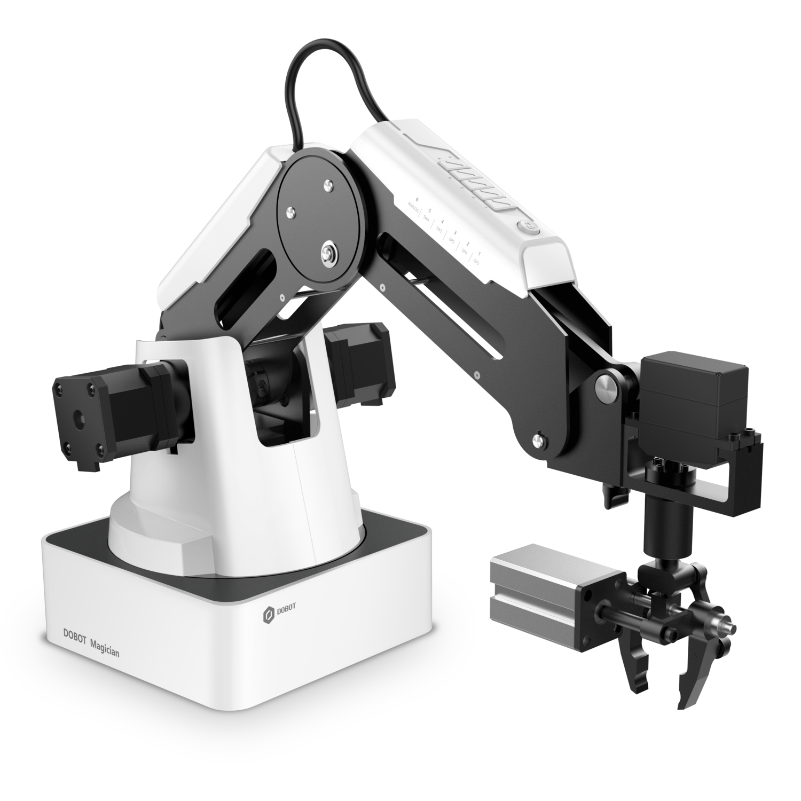
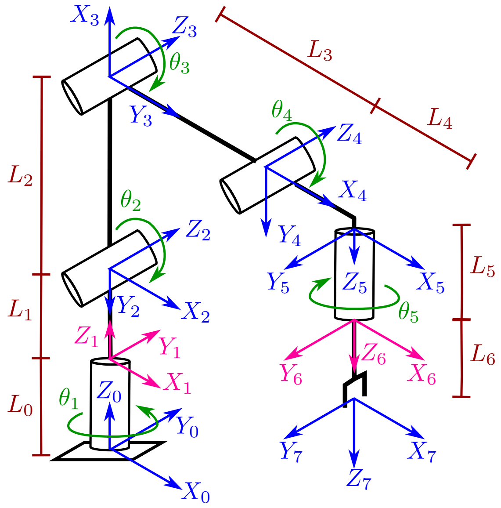

# 🤖 Dobot Magician Kinematic Model & Symbolic Analysis in MATLAB

[](https://www.mathworks.com/products/matlab.html)
[](https://creativecommons.org/licenses/by/4.0/)

This repository provides an open-source, mathematically transparent, and experimentally validated kinematic framework for the **4-DOF Dobot Magician** robotic manipulator. It contains scripts for analytical closed-form derivation (symbolic computation) and interactive 3D rigid-body simulation using MATLAB and the Robotics System Toolbox.

<p align="center">
  
  <br>
  <small><i>Figure 1: <a href="https://www.dobot-robots.com/products/education/magician.html" target="_blank">Dobot Magician</a> manipulator.</i></small>  
</p>

---

## 📌 Overview

The **Dobot Magician** is a desktop robotic arm featuring a hybrid mechanical architecture: a 1-DOF revolute base pedestal combined with an articulated 3-DOF planar four-bar parallelogram linkage. While proprietary control platforms (such as DobotStudio or Dobot Lab) treat the forward and inverse kinematics as a "black box", this project establishes a complete **7-frame Classical Denavit-Hartenberg (DH)** parameterization that:
1. Systematically converts the closed-loop parallelogram linkage into an equivalent serial computational kinematic chain.
2. Accurately maps the active joints ($\theta_1, \theta_2, \theta_3, \theta_5$) and the mechanically coupled passive wrist constraint ($\theta_4$).
3. Fully accounts for the table offset base frame $\{0\}$, the displaced base reference plane $\{1\}$ (used internally by Dobot Lab), mounting flange face $\{6\}$, and external Tool Center Point (TCP) attachments $\{7\}$.

---

## 🚀 Key Features

* **7-Frame Classical Denavit-Hartenberg Parameterization:** Full mathematical mapping from the resting surface (Frame $\{0\}$) up to the Tool Center Point (Frame $\{7\}$).
* **Parallelogram Linkage Decoupling:** Mimics the mechanical coupling constraint ($\theta_4 = -\theta_3$ when tool pitch is locked horizontally) across open serial transformation chains.
* **Symbolic & Numerical Kinematic Solvers:** Includes algebraic scripts to extract exact closed-form equations alongside numerical `rigidBodyTree` objects.
* **Direct Alignment with Native Dobot Lab Coordinates:** Computes Cartesian coordinates relative to the displaced base reference frame $\{1\}$ ($Z = L_0 = 130\text{ mm}$), matching proprietary software outputs to within $< 0.007\text{ mm}$.
* **Modular End-Effector Support:** Toggles seamlessly between the metallic mounting flange face ($L_5 = 8\text{ mm}$) and external attachments like pneumatic grippers or suction cups ($L_6 = 74\text{ mm}$).
* **Publication-Quality 3D Visualization:** Displays local coordinate axes ($X, Y, Z$) for all 8 frames, kinematic links, reference elevation planes, and real-time TCP readouts.

---

## 📊 Modeled Parameters & Kinematic Dimensions

<p align="center">
  
  <br>
  <small><i>Figure 2: Complete 7-frame classical Denavit-Hartenberg coordinate assignment.</i></small>
</p>

### Link Dimensions

| Parameter | Notation | Dimension | Description |
| :--- | :---: | :---: | :--- |
| **Base Pedestal Height** | $L_0$ | $130.0\text{ mm}$ | Vertical offset from table surface $\{0\}$ to displaced reference frame $\{1\}$ |
| **Shoulder Flange Thickness** | $L_1$ | $8.0\text{ mm}$ | Vertical distance from Frame $\{1\}$ to Joint 2 transverse axis |
| **Rear Arm Length** | $L_2$ | $135.0\text{ mm}$ | Shoulder link length between pitch axes |
| **Forearm Length** | $L_3$ | $147.0\text{ mm}$ | Elbow link length between pitch axes |
| **Wrist Link Length** | $L_4$ | $59.7\text{ mm}$ | Forearm extension to wrist joint axis |
| **Tool Flange Thickness** | $L_5$ | $8.0\text{ mm}$ | Fixed mechanical mounting flange face |
| **Pneumatic Gripper Extension** | $L_6$ | $74.0\text{ mm}$ | Distance from flange mounting face to the Tool Center Point (TCP) |

### Classical Denavit-Hartenberg (DH) Table

| Link ($n$) | $r_n\text{ (mm)}$ | $\alpha_n\text{ (rad)}$ | $d_n\text{ (mm)}$ | $q_n\text{ (rad)}$ | Description / Joint |
| :---: | :---: | :---: | :---: | :---: | :--- |
| **1** | $0$ | $0$ | $L_0 = 130$ | $0$ | Fixed Base Offset (Frame $\{0\} \rightarrow \{1\}$) |
| **2** | $0$ | $-\pi/2$ | $L_1 = 8$ | $q_1 = \theta_1$ | Base Pan Rotation (Joint 1) |
| **3** | $L_2 = 135$ | $0$ | $0$ | $q_2 = -\pi/2 + \theta_2$ | Shoulder Pitch (Joint 2) |
| **4** | $L_3 = 147$ | $0$ | $0$ | $q_3 = \pi/2 - \theta_2 + \theta_3$ | Elbow Pitch (Joint 3) |
| **5** | $L_4 = 59.7$ | $-\pi/2$ | $0$ | $q_4 = \theta_4 - \theta_3 = -\theta_3$ | Wrist Parallelism Offset (Joint 4) |
| **6** | $0$ | $0$ | $L_5 = 8$ | $0$ | Fixed Tool Flange Face |
| **7** | $0$ | $0$ | $L_6 = 74$ | $q_5 = \theta_5$ | Tool / Gripper Roll (Joint 5) |

---

## 📐 Closed-Form Forward Kinematic Equations

Evaluating the cumulative transformation matrix relative to the displaced base reference frame $\{1\}$ yields the following closed-form Cartesian coordinates:

### Flange Face (Frame $\{6\}$)
$$\begin{aligned}
p_X &= (L_2 \sin\theta_2 + L_3 \cos\theta_3 + L_4)\cos\theta_1 \\
p_Y &= (L_2 \sin\theta_2 + L_3 \cos\theta_3 + L_4)\sin\theta_1 \\
p_Z &= L_1 + L_2 \cos\theta_2 - L_3 \sin\theta_3 - L_5
\end{aligned}$$

### Tool Center Point / Gripper Tip (Frame $\{7\}$)
$$\begin{aligned}
p_X^{\text{TCP}} &= (L_2 \sin\theta_2 + L_3 \cos\theta_3 + L_4)\cos\theta_1 \\
p_Y^{\text{TCP}} &= (L_2 \sin\theta_2 + L_3 \cos\theta_3 + L_4)\sin\theta_1 \\
p_Z^{\text{TCP}} &= L_1 + L_2 \cos\theta_2 - L_3 \sin\theta_3 - L_5 - L_6
\end{aligned}$$

---

## 📁 Repository Structure & MATLAB Scripts

### 1. `Symbolic_Kinematics_Dobot.m`
* **Purpose:** Symbolic algebra solver that derives the analytical Forward Kinematic equations.
* **Details:**
  * Defines symbolic joint variables ($\theta_1, \theta_2, \theta_3, \theta_4, \theta_5$) and dimensional constants ($L_0$ through $L_6$).
  * Formulates individual classical DH transformation matrices ($T_0^1, T_1^2, \dots, T_6^7$).
  * Enforces the mechanical four-bar parallelogram constraint ($\theta_4 = 0 \Rightarrow q_4 = -\theta_3$).
  * Computes the total transformation matrix $T_1^7$ and simplifies the closed-form algebraic expressions for $p_X, p_Y, p_Z$.
  * Performs double-precision numerical substitutions for quick theoretical validation against arbitrary joint states.

### 2. `RigidBody_Kinematics_Dobot.m`
* **Purpose:** High-fidelity 3D simulation and numerical forward kinematics using MATLAB's `rigidBodyTree`.
* **Details:**
  * Programmatically constructs the 7-frame manipulator using classical DH parameters with `'column'` data format.
  * Attaches realistic CAD-like parametric geometries (cylinders, spheres, and gripper bounding boxes).
  * Evaluates forward kinematics with customizable reference frames (Global Frame $\{0\}$, Displaced Base Frame $\{1\}$, or Shoulder Frame $\{2\}$).
  * Supports interactive joint configuration adjustments (`theta1` to `theta5`) and gripper attachment toggling (`has_gripper`).
  * Features dedicated export modes (`ctrl_viz.headless_export`, `ctrl_viz.paper_mode`) to easily format and copy coordinate vectors directly to data tables/spreadsheets.

---

## 🛠️ Prerequisites

* **MATLAB** (R2020a or newer recommended)
* **Robotics System Toolbox**
* **Symbolic Math Toolbox** (for `Symbolic_Kinematics_Dobot.m`)

---

## 💻 How to Use

1. **Clone the repository:**
   ```bash
   git clone [https://github.com/gadilsoncandido/dobot_magician.git](https://github.com/gadilsoncandido/dobot_magician.git)
   cd dobot_magician